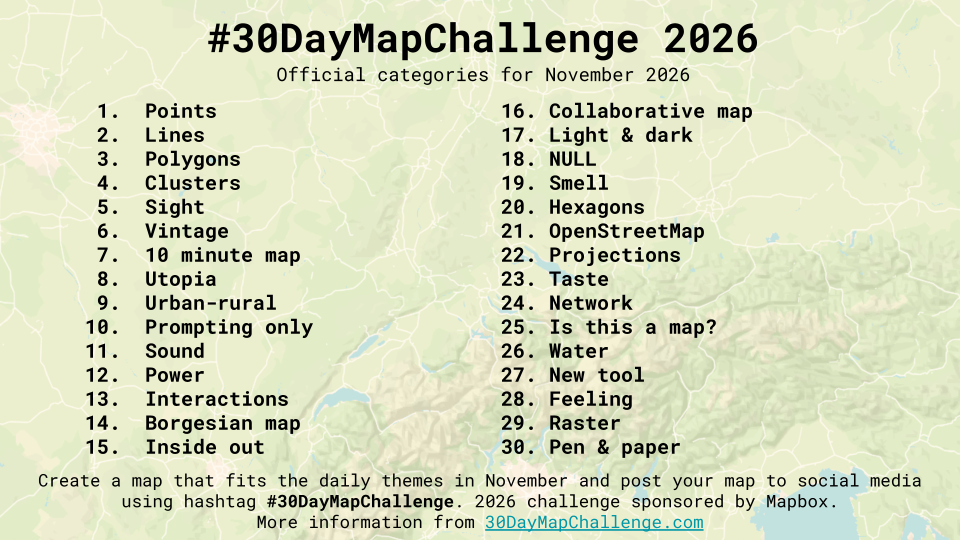
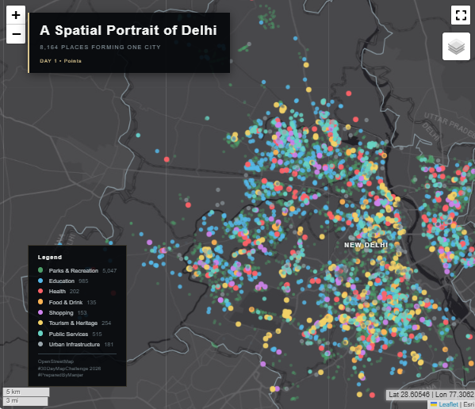
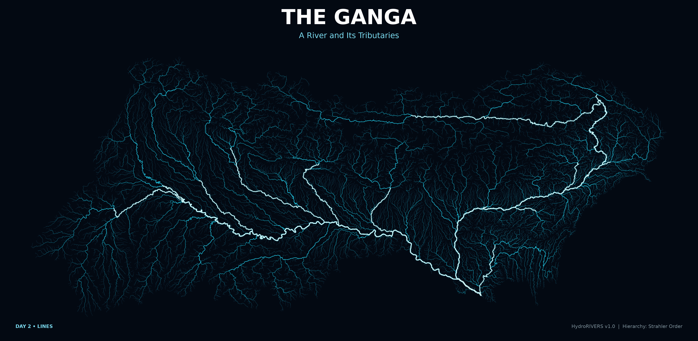
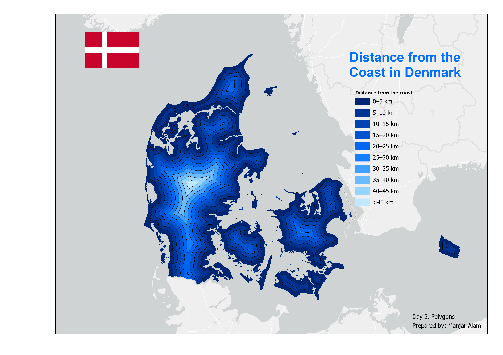
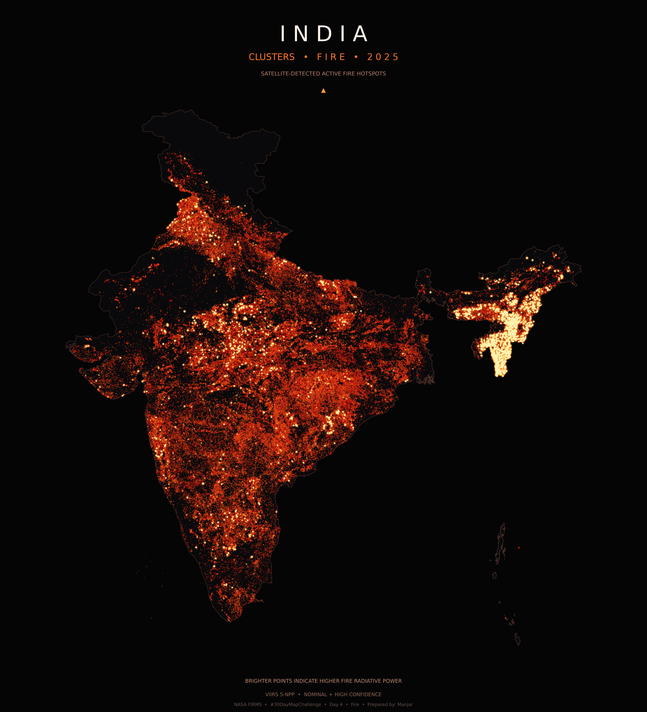
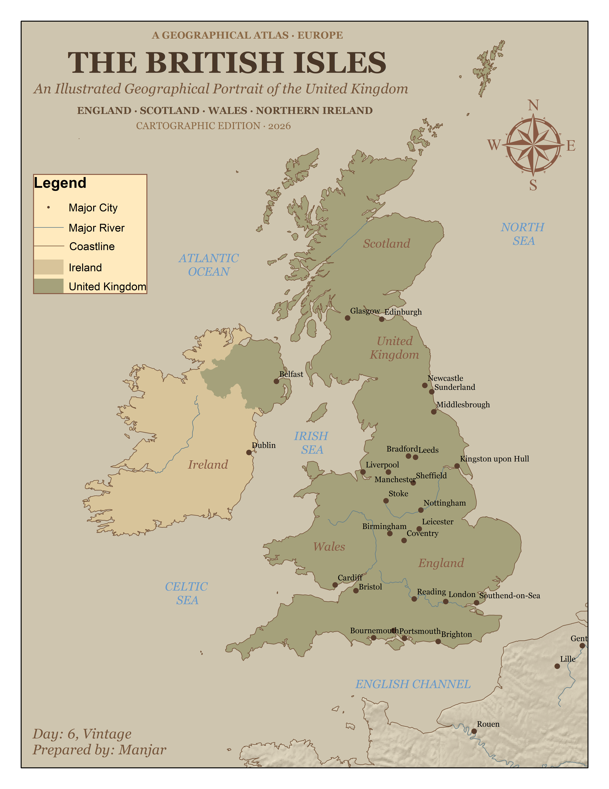

---
hide:
  - toc
  - navigation
---

 
# #30DayMapChallenge

A collection of 30 days of geospatial exploration, combining GIS, Remote Sensing, Python, spatial analysis, interactive mapping, and cartographic design. Each map explores a different geographical theme, from urban networks and land use to vegetation, climate, terrain, hydrology, and global connectivity.

Explore the map gallery below. Select **View Project** to learn about the objective, data sources, methods, and tools used for each map, then open the interactive HTML visualization to zoom, pan, and explore the map features.
<!-- Replace the path below with the relative path to your image in your MkDocs project docs folder -->

  

---

<!-- Day 01 -->

**[Day 1. Points](30_day_map/maps_md/day-01.md)**

A Spatial Portrait of Delhi.

`Urban GIS` `POI Mapping` `Python`

[View Project](30_day_map/maps_md/day-01.md){ .md-button }

<!-- Day 02 -->

**[Day 2. Lines](30_day_map/maps_md/day-01.md)**

The Ganga: A River and Its Tributaries

 `River` `Hydrology` `Ganga`

[View Project](30_day_map/maps_md/day-02.md){ .md-button }

<!-- Day 03 -->

**[Day 3. Polygons](30_day_map/maps_md/day-03.md)**

Beyond the Shore: Mapping Coastal Distance

 `Coastline` `Cartography` `Denmark`

[View Project](30_day_map/maps_md/day-03.md){ .md-button }

<!-- Day 04 -->

**[Day 4. Clusters](30_day_map/maps_md/day-04.md)**

Satellite-based active fire mapping and spatial clustering

 `Clusters` `India` `Fire`

[View Project](30_day_map/maps_md/day-04.md){ .md-button }

<!-- Day 05 -->

**[Day 5. Sight](30_day_map/maps_md/day-05.md)**

3D terrain visualization and elevation mapping

 `terrain` `sight` `Uttarakhand` `elevation` 

[View Project](30_day_map/maps_md/day-05.md){ .md-button }

<!-- Day 06 -->

**[Day 6. Vintage](30_day_map/maps_md/day-06.md)**

The British Isles: An Illustrated Geographical Portrait

 `Vintage` `United Kingdom` `Thematic` `Cartography` 

[View Project](30_day_map/maps_md/day-06.md){ .md-button }

<!-- 10 Minute Map -->

**[Day 10, Minute Map](30_day_map/maps_md/day-07.md)**

India in One Colour

 `10MinuteMap` `India` `Cartography` 

[View Project](30_day_map/maps_md/day-07.md){ .md-button }

---

## Explore the Maps

Each project page provides a summary of the map, its methods and tools, and links to the interactive HTML output and source code where available. The gallery is a showcase of geospatial learning, experimentation, and cartographic design.
