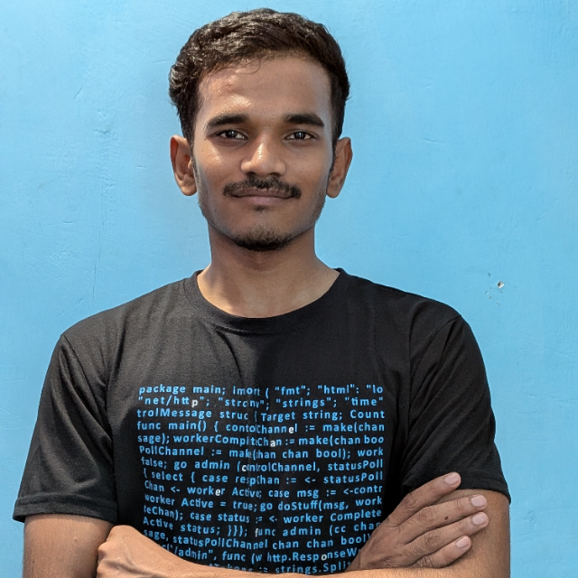
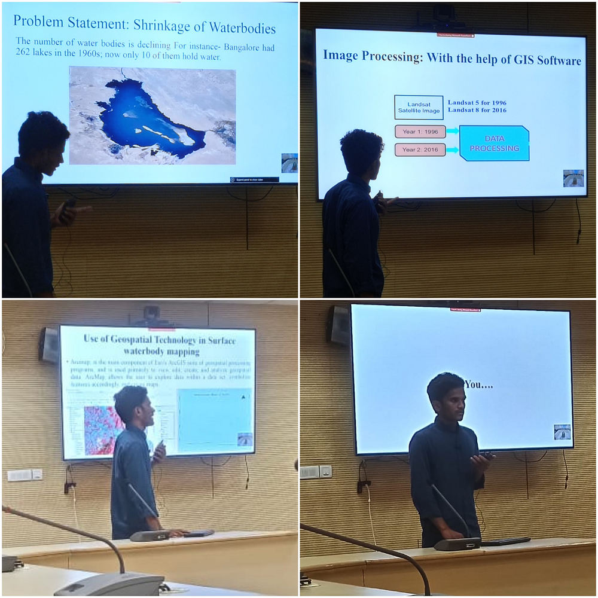

---
hide:
  - toc
  - navigation
---

  
  <h1>Manjar Alam</h1>
  
<strong>Young Professional-II (Remote Sensing & GIS) | ICAR–IASRI, New Delhi</strong>

  
<em>• Remote Sensing • GIS • Geospatial AI • Agricultural Applications • Drone Mapping • Machine Learning • WebGIS</em>

---

## About Me

I am a **Remote Sensing and GIS professional** with experience in geospatial analysis, agricultural remote sensing, drone image processing, machine learning, and WebGIS development. Currently, I work as a **Young Professional-II (Remote Sensing & GIS)** at **ICAR–Indian Agricultural Statistics Research Institute (ICAR-IASRI), New Delhi**, where I contribute to national research projects involving agricultural monitoring, geospatial analytics, and spatial data management.

My expertise includes **GIS analysis, satellite image processing, drone data processing, spatial modelling, climate data analysis, Google Earth Engine, Python automation, and machine learning for geospatial applications**. I enjoy transforming complex spatial datasets into meaningful insights that support decision-making in agriculture, water resources, and environmental management.

My research interests include **precision agriculture, groundwater recharge mapping, climate change, crop monitoring, environmental modelling, and GeoAI**. I am passionate about building innovative geospatial solutions that bridge research with real-world applications. 

  

---

[Explore My Projects :material-arrow-right:](projects/project.md){ .md-button .md-button--primary }
[Download CV :material-download:](assets/Manjar_Alam_CV.pdf){ .md-button }

---

## Technical Skills

- :material-earth:{ .lg .middle } **Remote Sensing & GIS**

    ---

    - ArcGIS Pro, ArcMap, QGIS
    - ERDAS Imagine, ENVI, SNAP, Pix4Dmapper
    - Image Interpretation & Photogrammetry
    - Cartography, Georeferencing, Geocoding & Digitization
    - Spatial Analysis & Terrain Analysis
    - LULC Classification & Change Detection
    - Groundwater & Watershed Analysis

- :material-satellite-variant:{ .lg .middle } **Satellite & Drone Data**

    ---

    - Sentinel-1 (SAR), Sentinel-2, Landsat 5/7/8/9
    - MODIS, NISAR
    - UAV/Drone Data Processing
    - Orthomosaic, DSM & DTM Generation
    - Vegetation Indices (NDVI, SAVI, EVI, NDWI)
    - Time-Series Remote Sensing
    - Crop Health Monitoring

- :material-robot:{ .lg .middle } **Machine Learning & GeoAI**

    ---

    - Random Forest, XGBoost, SVM, Multiple Linear Regression
    - Scikit-learn, OBIA
    - Model Validation & Hyperparameter Tuning
    - Accuracy Assessment & ROC-AUC
    - Spatial Machine Learning

- :material-code-braces:{ .lg .middle } **Programming & Automation**

    ---

    - Python (NumPy, Pandas, GeoPandas, GDAL, Rasterio, Xarray, RichDEM)
    - R Programming
    - Google Earth Engine (JavaScript & Python API)
    - ArcPy & ModelBuilder
    - ETL & Data Processing
    - QA/QC Automation
    - Jupyter Notebook
    

- :material-database:{ .lg .middle } **Databases & WebGIS**

    ---

    - PostgreSQL/PostGIS
    - GeoServer, OpenLayers & Leaflet
    - ArcGIS Online (Experience Builder, Instant Apps, Dashboard)
    - HTML, CSS & JavaScript
    - WMS, WFS & REST Services

- :material-chart-line:{ .lg .middle } **Climate, Agriculture & Research**

    ---

    - Climate Data Analysis (NetCDF, ERA5, SPI, SPEI)
    - Agricultural & Crop Modelling (InfoCrop, DSSAT, APSIM)
    - Spatial Statistics & Time-Series Analysis
    - Scientific Writing
    - OriginPro, LaTeX, Zotero & Mendeley
    - Power BI & Microsoft Excel

---

## Connect

[GitHub](https://github.com/Manjar-Alam){ .md-button }
[LinkedIn](https://www.linkedin.com/in/manjar-alam){ .md-button }
[Medium](https://medium.com/@Manjar-Alam){ .md-button }
[Email](mailto:manjar.edu@gmail.com){ .md-button }
[Google Scholar Profile](https://scholar.google.com/citations?user=tfQJotIAAAAJ){ .md-button }