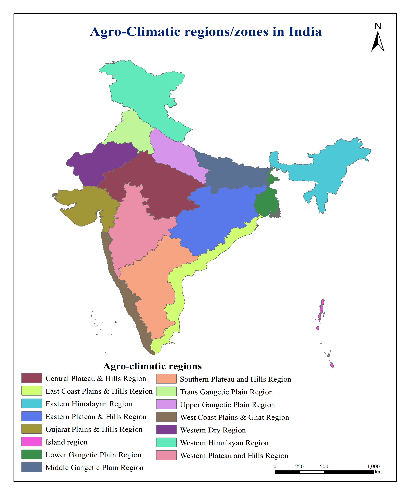

# Agro-Climatic Regions of India

## Overview

Created a thematic map illustrating India's agro-climatic regions based on climate, topography, soil, and vegetation characteristics. The map supports agricultural planning, crop suitability assessment, and regional resource management.

**Study Area:** India

**Duration:** Personal Learning Project (2025)

**Role:** Solo project  

**Status:** Completed

---

## Methods & Tools

**Data Sources**

- ESRI
- DivaGIS

**Tools Used**

* ArcMap
* Excel

---

## Key Findings

- Mapped India's agro-climatic zones.
- Supported crop suitability assessment.
- Assisted regional agricultural planning.
---

## Links

[View Project](LINK){ .md-button }
[Esri Dataset](LINK){ .md-button }
