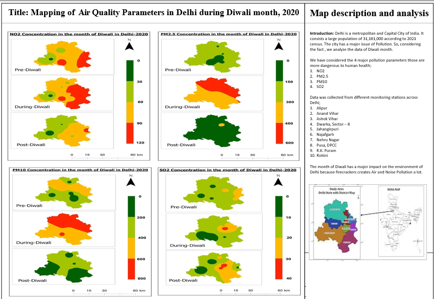

# Delhi Air Quality Mapping

## Overview

Analyzed the spatial distribution of major air pollutants, including PM₂.₅, PM₁₀, NO₂, and SO₂, across Delhi during the Diwali period. The project used GIS techniques to identify pollution hotspots and visualize variations in air quality across monitoring stations.

**Study Area:** Delhi

**Duration:** Personal Learning Project (2026)

**Role:** Solo project  

**Status:** Completed

---

## Methods & Tools

**Data Sources**

- CPCB Air Quality Monitoring Stations
- Delhi Administrative Boundary
- OpenStreetMap Basema

**Tools Used**

* ArcMap
* Microsoft Excel

---

## Key Findings

- Mapped spatial distribution of PM₂.₅, PM₁₀, NO₂, and SO₂.
- Identified pollution hotspots during the Diwali period.
- Compared pollutant concentrations across monitoring stations.
---

## Links

[View Project](#LINK){ .md-button }
[View Dataset Catalog](https://aqicn.org/city/delhi/){ .md-button }
