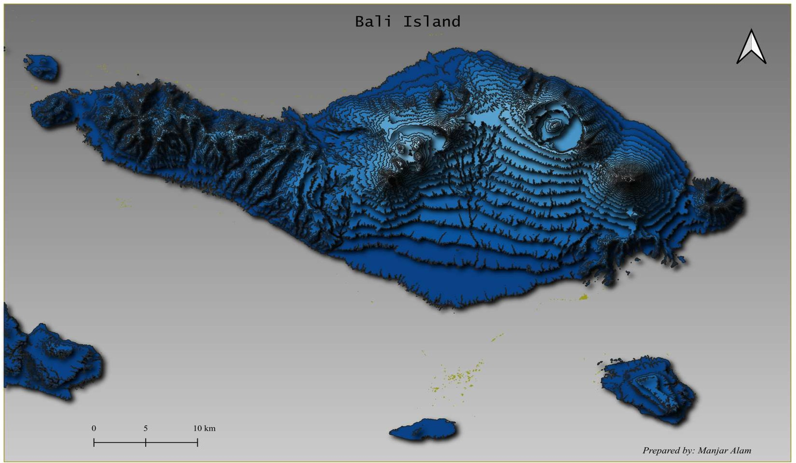

# Terrain Visualization Using SRTM DEM

## Overview

Developed a high-resolution terrain visualization of Bali Island using SRTM Digital Elevation Model (DEM) data in QGIS. The map highlights elevation variations, landforms, and topographic features through hillshade and contour visualization, providing valuable insights for terrain analysis and environmental planning.

**Study Area:** Bali, Indonesia

**Duration:** Personal Learning Project (2023)

**Role:** Solo project  

**Status:** Completed

---

## Methods & Tools

**Data Sources**

- SRTM Digital Elevation Model (DEM)

**Tools Used**

* QGIS

---

## Key Findings

- Visualized terrain using hillshade and contours.
- Identified elevation patterns and landforms.
- Enhanced topographic interpretation.
---

## Links

[View Project](#LINK){ .md-button }
[SRTM Data](https://earthexplorer.usgs.gov/){ .md-button }
