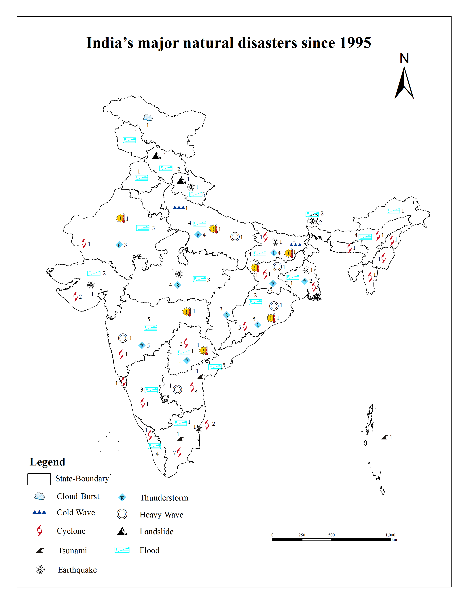

# Plate Tectonics and Earthquakes

## Overview

Developed an interactive ArcGIS Online application to visualize global plate boundaries and earthquake events. The application helps users explore the relationship between tectonic plates and seismic activity through an interactive web interface.

**Study Area:** Global

**Duration:** Personal Learning Project (2026)

**Role:** Solo project  

**Status:** Completed

---

## Methods & Tools

**Data Sources**

- USGS Earthquake Catalog
- ArcGIS Living Atlas

**Tools Used**

* ArcGIS Online
* ArcGIS Instant Apps

---

## Key Findings

- Interactive visualization of earthquake locations.
- Displayed tectonic plate boundaries.
- Improved understanding of global seismic patterns.
---

## Links

[View Instant App](#LINK){ .md-button }
[USGS Earthquake Catalog](#LINK){ .md-button }
