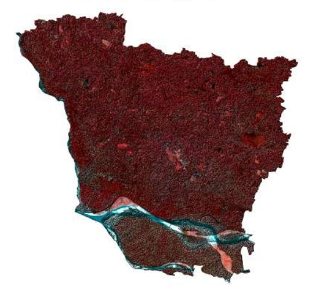

# False Color Composite (FCC) Generation

## Overview

Generated a False Color Composite (FCC) using multispectral satellite imagery to enhance the visualization of vegetation, water bodies, and built-up areas. The FCC improves feature discrimination and serves as a foundation for land cover interpretation and remote sensing analysis.

**Study Area:** Vaishali, Bihar

**Duration:** Personal Learning Project (2025)

**Role:** Solo project  

**Status:** Completed

---

## Methods & Tools

**Data Sources**

- Sentinel-2 (Copernicus)
- DEM (SRTM)

**Tools Used**

* GEE
* ArcMap

---

## Key Findings

- Enhanced visualization of vegetation and water bodies.
- Improved land cover interpretation.
- Supported image classification workflows.
---

## Links

[View Project](#LINK){ .md-button }
[View Dataset Catalog](https://browser.dataspace.copernicus.eu/){ .md-button }
