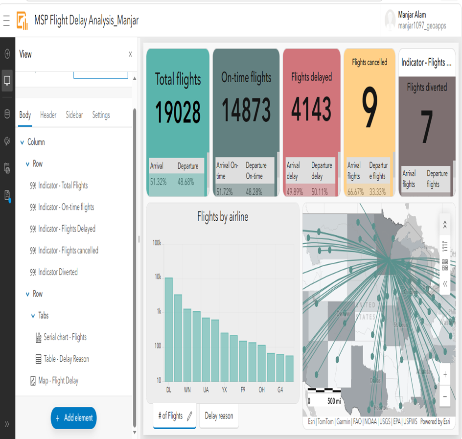

# Flight Delay and Cancellation Dashboard

## Overview

Built an interactive ArcGIS Dashboard to visualize flight delays and cancellations at Minneapolis–Saint Paul International Airport. The dashboard integrates maps, charts, and filters to help users analyze operational performance and travel patterns.

**Study Area:** Minneapolis–Saint Paul International Airport, USA

**Duration:** Personal Learning Project (2026)

**Role:** Solo project  

**Status:** Completed

---

## Methods & Tools

**Data Sources**

- ArcGIS Online Sample Dataset

**Tools Used**

* ArcGIS Dashboards
* ArcGIS Online

---

## Key Findings

- Interactive airport performance dashboard.
- Visualized flight delays and cancellations.
- Enabled dynamic filtering and analysis.
---

## Links

[View Dashboard](LINK){ .md-button }
[Dataset](LINK){ .md-button }
