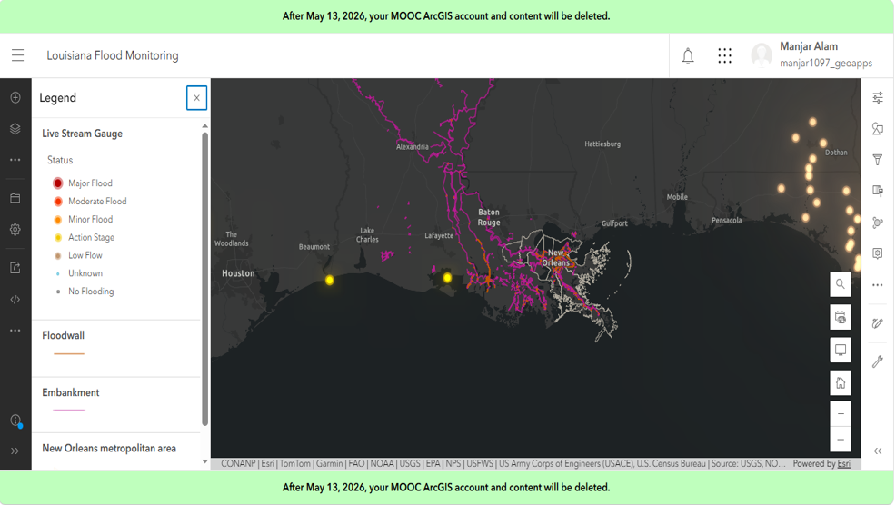

# Louisiana Flood Monitoring Dashboard

## Overview

Designed an ArcGIS Dashboard for monitoring flood conditions through interactive maps and visual indicators. The dashboard provides an intuitive interface for exploring flood-related information and supports situational awareness during flood events.

**Study Area:** Louisiana, USA

**Duration:** Personal Learning Project (2026)

**Role:** Solo project  

**Status:** Completed

---

## Methods & Tools

**Data Sources**

- ArcGIS Living Atlas
- FEMA Flood Dat

**Tools Used**

* ArcGIS Dashboards
* ArcGIS Online

---

## Key Findings

- Interactive flood monitoring dashboard.
- Integrated maps with charts and indicators.
- Demonstrated real-time spatial visualization capabilities
---

## Links

[View Dashboard](#LINK){ .md-button }
[FEMA DAta](#LINK){ .md-button }
