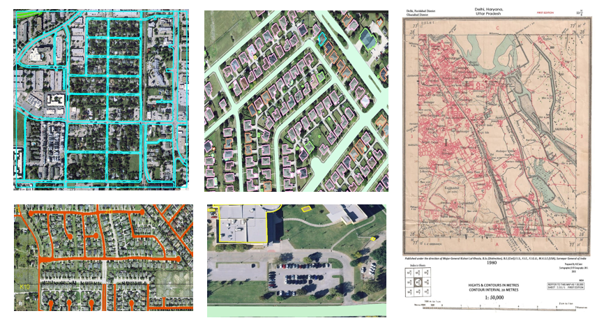

# Georeferencing and Digitization

## Overview

Performed georeferencing of scanned maps using ground control points and digitized key geographic features into vector datasets. The project produced spatially accurate layers suitable for GIS analysis and mapping applications.

**Study Area:** Delhi + Global

**Duration:** Personal Learning Project (2022)

**Role:** Solo project  

**Status:** Completed

---

## Methods & Tools

**Data Sources**

- Cadastral Map

**Tools Used**

* Arcmap

---

## Key Findings

- Produced spatially accurate vector datasets.
- Improved map usability through digitization.
- Created GIS-ready spatial layers.
---

## Links

[View Projet](#LINK){ .md-button }
[Esri Documentation](https://doc.esri.com/en/arcgis-pro/latest/help/data/imagery/overview-of-georeferencing.html){ .md-button }
