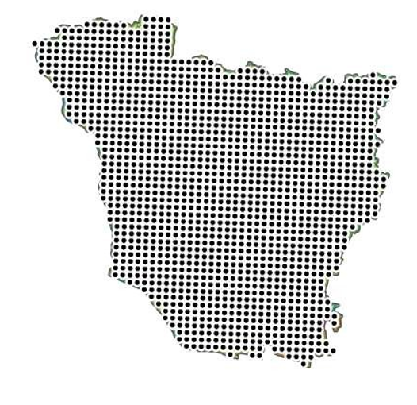

# Spatial Sampling Grid Generation

## Overview

Created a systematic spatial sampling grid to generate uniformly distributed sample points across the study area for geospatial analysis and field data collection. The sampling framework ensures consistent spatial coverage and supports statistical, environmental, and remote sensing studies.

**Study Area:** Vaishali, Bihar

**Duration:** Personal Learning Project (2024)

**Role:** Solo project  

**Status:** Completed

---

## Methods & Tools

**Data Sources**

- DivaGIS

**Tools Used**

* ArcMap 
* Centroid

---

## Key Findings

- Generated systematic sampling points.
- Improved spatial sampling consistency.
- Supported field survey planning.
---

## Links

[View Project](#LINK){ .md-button }
[ESRI Documentation](https://www.esri.com/arcgis-blog/products/arcgis-pro/design-planning/introducing-create-spatial-sampling-locations-tool-in-arcgis-pro-3-3){ .md-button }
