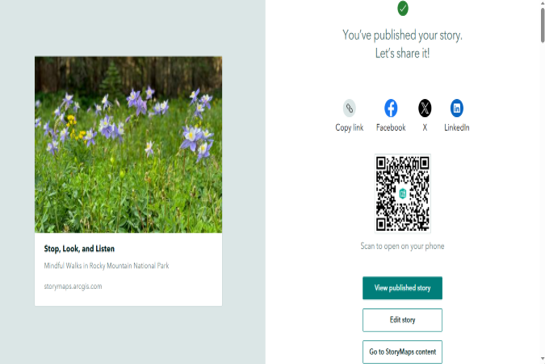

# Mindful Walks in Rocky Mountain National Park

## Overview

Developed an interactive ArcGIS StoryMap showcasing scenic trails, natural landscapes, and key points of interest within Rocky Mountain National Park. The project combines maps, multimedia, and narrative content to create an engaging digital storytelling experience that enhances visitor exploration and geographic understanding.

**Study Area:** Rocky Mountain National Park, Colorado, USA 

**Duration:** Personal Learning Project (2026)

**Role:** Solo project  

**Status:** Completed

---

## Methods & Tools

**Data Sources**

- ArcGIS Living Atlas
- Esri Basemaps
- National Park Service (NPS) Data

**Tools Used**

* ArcGIS StoryMaps
* ArcGIS Online

---

## Key Findings

- Developed an interactive web-based storytelling application.
- Combined maps, multimedia, and narrative content.
- Enhanced user engagement through spatial storytelling.

---

## Links

[View StoryMap](LINK){ .md-button }
[View Dataset Catalog](LINK){ .md-button }
