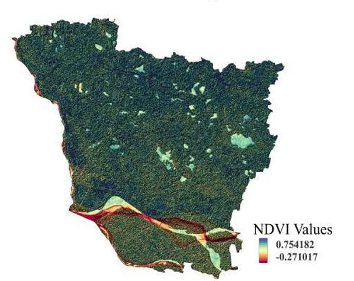

# Normalized Difference Vegetation Index (NDVI) Mapping

## Overview

Computed the Normalized Difference Vegetation Index (NDVI) from satellite imagery to assess vegetation health, density, and spatial distribution across the study area. The resulting map identifies healthy and stressed vegetation, supporting agricultural monitoring and environmental assessment.

**Study Area:** Vaishali, Bihar

**Duration:** Personal Learning Project (2024)

**Role:** Solo project

**Status:** Completed

---

## Methods & Tools

**Data Sources**

- Sentinel-2 (Copernicus)
- DEM

**Tools Used**

* GEE
* ArcMap

---

## Key Findings

- Assessed vegetation health.
- Identified stressed and healthy vegetation.
- Supported agricultural monitoring.
---

## Links

[View Project](LINK){ .md-button }
[View Dataset Catalog](LINK){ .md-button }
