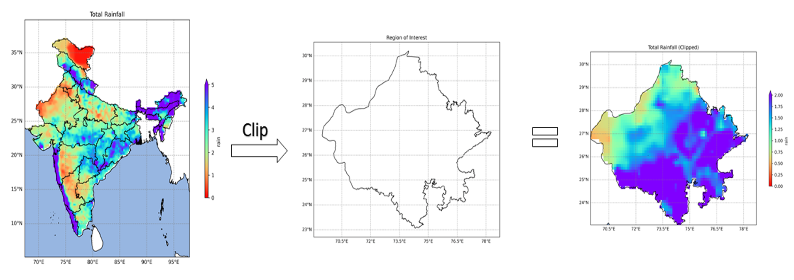

# Clipping and Visualizing NetCDF Data Using Python

## Overview

Developed a Python workflow to clip large NetCDF datasets using administrative boundaries and generate spatial visualizations for the region of interest. The workflow improved processing efficiency and simplified climate data analysis

**Study Area:** Rajasthan, India

**Duration:** Personal Learning Project (2026)

**Role:** Solo project  

**Status:** Completed

---

## Methods & Tools

**Data Sources**

- IMD Pune
- Administrative Boundary Shapefile

**Tools Used**

* Python
* Xarray
* Rioxarray
* GeoPandas
* Matplotlib

---

## Key Findings

- Automated clipping of large NetCDF datasets.
- Improved processing efficiency.
- Generated publication-quality climate maps.
---

## Links

[View Code](#LINK){ .md-button }
[Medium Article](https://medium.com/@Manjar-Alam/clipping-and-visualizing-netcdf-data-using-python-84dfbbbce0a5){ .md-button }
