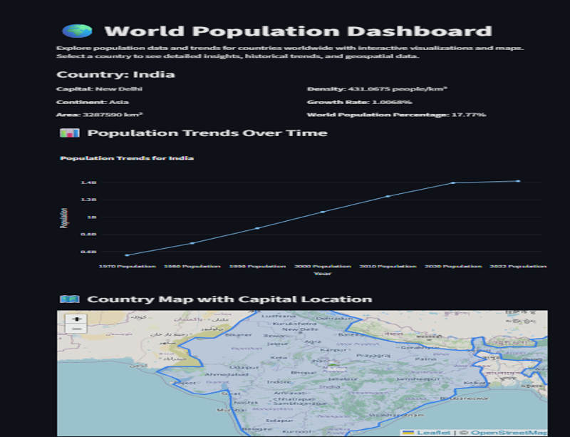

# Interactive World Population Dashboard

## Overview

Developed a Streamlit-based interactive dashboard to visualize and compare population statistics across countries. The application enables users to explore demographic trends through dynamic charts, maps, and user-friendly visualizations.

**Study Area:** Global

**Duration:** Personal Learning Project (2024)

**Role:** Solo project  

**Status:** Completed

---

## Methods & Tools

**Data Sources**

- World Bank
- United Nations Population Data

**Tools Used**

* Python
* Streamlit
* Plotly
* Pandas

---

## Key Findings

- Interactive global population visualization.
- Country-wise comparison using dynamic charts.
- Responsive web application built with Streamlit.
---

## Links

[View Dashboard](LINK){ .md-button }
[World Bank Data](LINK){ .md-button }
