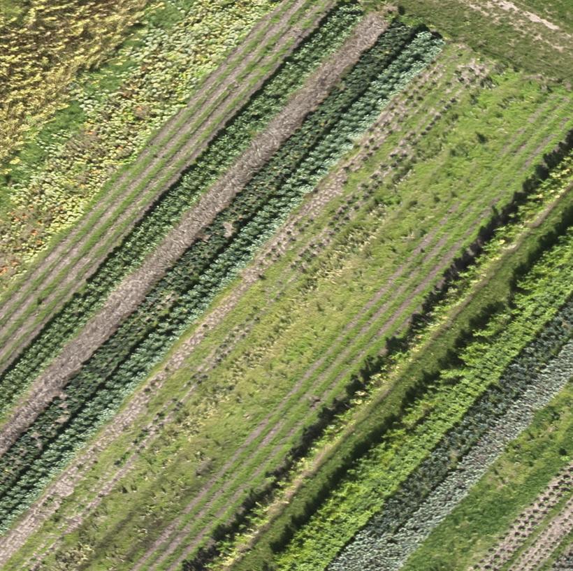
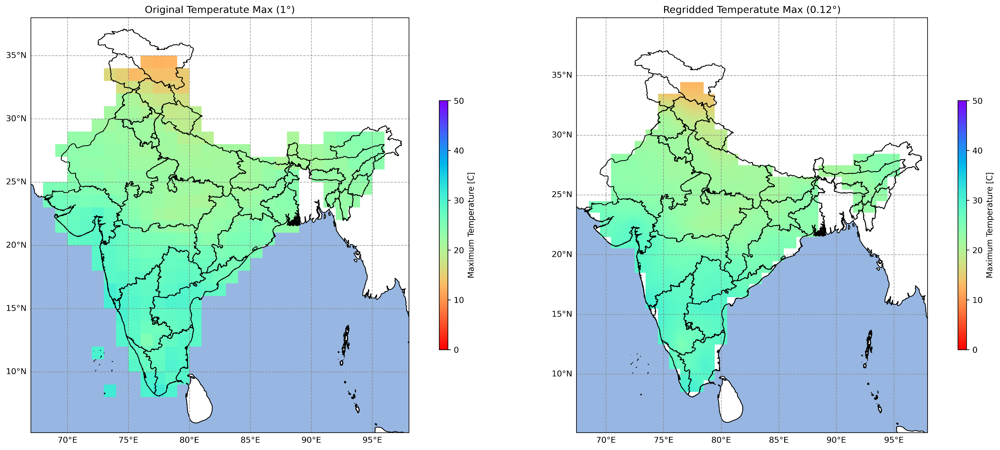
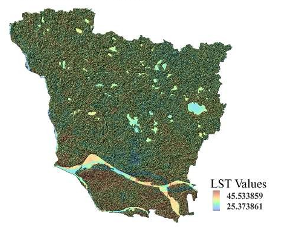

---
hide:
  - toc
  - navigation
---

# Projects

A selection of my geospatial projects. Click any card to see the full write-up.

 <!-- #proj1 -->

**[Drone-Based Crop Health Monitoring](drone.md)**

Processed UAV imagery to assess crop health using vegetation indices and generate high-resolution orthomosaics for agricultural monitoring.

`Python` `Pix4DMapper` `QGIS`

[View Project →](drone.md){ .md-button }

 <!-- #proj2 -->

**[Delhi Air Quality Mapping](air_quality.md)**

Analyzed the spatial distribution of major air pollutants, including PM₂.₅, PM₁₀, NO₂, and SO₂, across Delhi during the Diwali period. The project used GIS techniques to identify pollution hotspots and visualize variations in air quality across monitoring stations.

`ArcMap` `Excel` `Interpolation`

[View Project →](air_quality.md){ .md-button }

 <!-- #proj3 -->

**[NDVI Time Series Analysis](timeSeries.md)**

Performed temporal analysis of NDVI to monitor seasonal vegetation dynamics and assess crop growth patterns in Jaunpur district. Time-series satellite imagery was used to evaluate changes in vegetation health throughout the agricultural season.

`ArcMap` `Google Earth Engine` `Excel` `Crop Phenology` 

[View Project →](timeSeries.md){ .md-button }

 <!-- #proj4 -->

**[Clipping and Visualizing NetCDF Data Using Python](netcdf_clip.md)**

Developed a Python workflow to clip large NetCDF datasets using administrative boundaries and generate spatial visualizations for the region of interest. The workflow improved processing efficiency and simplified climate data analysis

`IMDlib` `xarray` `Geopandas` `dask`

[View Project →](netcdf_clip.md){ .md-button }

 <!-- #proj5 -->

**[Seasonal Average Rainfall Visualization](rainfall.md)**

Processed long-term climate datasets to calculate seasonal average rainfall and visualize spatial rainfall variability using Python. The resulting maps provide insights into seasonal precipitation patterns and support climate-related studies.

`NetCDF` `cartopy` `matplotlib` `time series` 

[View Project →](rainfall.md){ .md-button }

 <!-- #proj6 -->

**[Standardized Precipitation Index (SPI) Analysis](spi.md)**

Developed a Python-based workflow to calculate the Standardized Precipitation Index (SPI) from historical precipitation data for drought assessment. The project identified wet and dry conditions across multiple time scales to support climate monitoring and water resource planning.

`Drought` `Rainfall` `Time Series` 

[View Project →](spi.md){ .md-button }

 <!-- #proj7 -->

**[Regridding IMD Temperature Data Using Python](regrid.md)**

Implemented a spatial regridding workflow to convert coarse-resolution IMD temperature datasets into finer-resolution grids using Python. The enhanced datasets improve compatibility with regional climate analysis and geospatial modeling.

`numpy` `xarray` `Interpolation` `IMD`

[View Project →](regrid.md){ .md-button }

 <!-- #proj8 -->

**[Georeferencing and Digitization](georef.md)**

Performed georeferencing of scanned maps using ground control points and digitized key geographic features into vector datasets. The project produced spatially accurate layers suitable for GIS analysis and mapping applications.

`Control Points` `RMS Error` `Topology` `Vectorization`

[View Project →](georef.md){ .md-button }

 <!-- #proj9 -->

**[State-wise Annual Tractor Sales Mapping](tractor.md)**

Created a thematic map to visualize state-wise tractor sales across India using proportional symbols and spatial analysis techniques. The project highlights regional patterns of agricultural mechanization and supports comparative analysis of farming development.

`Choropleth ` `Symbology` `Theme` `Statistics`

[View Project →](tractor.md){ .md-button }

 <!-- #proj10 -->

**[Agro-Climatic Regions of India](agro.md)**

Created a thematic map illustrating India's agro-climatic regions based on climate, topography, soil, and vegetation characteristics. The map supports agricultural planning, crop suitability assessment, and regional resource management.

`Climate` `Agriculture`

[View Project →](agro.md){ .md-button }

 <!-- #proj11 -->

**[Explore Delhi – ArcGIS StoryMap](storyMap.md)**

Created an interactive StoryMap showcasing important locations, historical landmarks, and geographic information about Delhi using ArcGIS StoryMaps. The project combines maps, multimedia, and narrative content to enhance user engagement.

`ArcGIS Online` `Tourism` `Heritage` 

[View Project →](storyMap.md){ .md-button }

 <!-- #proj12 -->

**[Plate Tectonics and Earthquakes](earthquake.md)**

Developed an interactive ArcGIS Online application to visualize global plate boundaries and earthquake events. The application helps users explore the relationship between tectonic plates and seismic activity through an interactive web interface.

`ArcGIS Online` `Instant Apps` `Earthquake` 

[View Project →](earthquake.md){ .md-button }

 <!-- #proj13 -->

**[Louisiana Flood Monitoring Dashboard](flood.md)**

Designed an ArcGIS Dashboard for monitoring flood conditions through interactive maps and visual indicators. The dashboard provides an intuitive interface for exploring flood-related information and supports situational awareness during flood events.

`ArcGIS Online` `Dashboard` `Flood`

[View Project →](flood.md){ .md-button }

 <!-- #proj14 -->

**[Flight Delay and Cancellation Dashboard](flight.md)**

Built an interactive ArcGIS Dashboard to visualize flight delays and cancellations at Minneapolis–Saint Paul International Airport. The dashboard integrates maps, charts, and filters to help users analyze operational performance and travel patterns.

`ArcGIS Dashboard` `Flights`

[View Project →](flight.md){ .md-button }

 <!-- #proj15 -->

**[Interactive World Population Dashboard](population.md)**

Developed a Streamlit-based interactive dashboard to visualize and compare population statistics across countries. The application enables users to explore demographic trends through dynamic charts, maps, and user-friendly visualizations.

`Streamlit` `Github` `Demography` `GeoJson`

[View Project →](population.md){ .md-button }

 <!-- #proj16 -->

**[False Color Composite (FCC) Generation](fcc.md)**

Generated a False Color Composite (FCC) using multispectral satellite imagery to enhance the visualization of vegetation, water bodies, and built-up areas. The FCC improves feature discrimination and serves as a foundation for land cover interpretation and remote sensing analysis.

`FCC` `Sentinel-2`

[View Project →](fcc.md){ .md-button }

 <!-- #proj17 -->

**[Normalized Difference Vegetation Index (NDVI) Mapping](ndvi.md)**

Computed the Normalized Difference Vegetation Index (NDVI) from satellite imagery to assess vegetation health, density, and spatial distribution across the study area. The resulting map identifies healthy and stressed vegetation, supporting agricultural monitoring and environmental assessment.

`Crop` `Vegetation`

[View Project →](ndvi.md){ .md-button }

 <!-- #proj18 -->

**[Land Surface Temperature (LST) Mapping](lst.md)**

Derived Land Surface Temperature (LST) from thermal satellite imagery to analyze the spatial variation of surface temperatures within the study area. The map helps identify temperature hotspots and supports studies related to urban heat islands, climate monitoring, and environmental.

`Temperature` `Urban Heat Islands` `Climate`

[View Project →](lst.md){ .md-button }

 <!-- #proj19 -->

**[Spatial Sampling Grid Generation](grid.md)**

Created a systematic spatial sampling grid to generate uniformly distributed sample points across the study area for geospatial analysis and field data collection. The sampling framework ensures consistent spatial coverage and supports statistical, environmental, and remote sensing studies.

`Points` `Spatial Grids`

[View Project →](grid.md){ .md-button }

 <!-- #proj20 -->

**[Terrain Visualization Using SRTM DEM](bali.md)**

Developed a high-resolution terrain visualization of Bali Island using SRTM Digital Elevation Model (DEM) data in QGIS. The map highlights elevation variations, landforms, and topographic features through hillshade and contour visualization, providing valuable insights for terrain analysis and environmental planning.

`QGIS` `SRTM` `3D`

[View Project →](bali.md){ .md-button }

 <!-- #proj21 -->

**[Mindful Walks in Rocky Mountain National Park](nat_park.md)**

Developed an interactive ArcGIS StoryMap showcasing scenic trails, natural landscapes, and key points of interest within Rocky Mountain National Park. The project combines maps, multimedia, and narrative content to create an engaging digital storytelling experience that enhances visitor exploration and geographic understanding.

`AEF Embeddings` `Google Earth Engine`

[View Project →](nat_park.md){ .md-button }

 <!-- #proj21 

**[State-wise Annual Tractor Sales Mapping](satellite-embedding-project.md)**

Created a thematic map to visualize state-wise tractor sales across India using proportional symbols and spatial analysis techniques. The project highlights regional patterns of agricultural mechanization and supports comparative analysis of farming development.

`AEF Embeddings` `Google Earth Engine`

[View Project →](satellite-embedding-project.md){ .md-button }

-->

