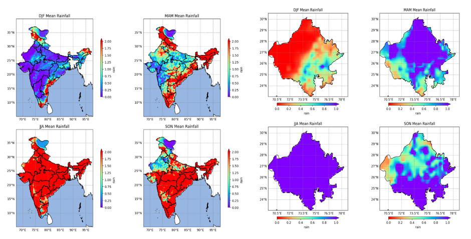

# Seasonal Average Rainfall Visualization

## Overview

Processed long-term climate datasets to calculate seasonal average rainfall and visualize spatial rainfall variability using Python. The resulting maps provide insights into seasonal precipitation patterns and support climate-related studies.

**Study Area:** India

**Duration:** Personal Learning Project (2026)

**Role:** Solo project  

**Status:** Completed

---

## Methods & Tools

**Data Sources**

- IMD Rainfall NetCDF Data

**Tools Used**

* Python
* Xarray
* Cartopy
* Matplotlib

---

## Key Findings

- Calculated seasonal rainfall averages.
- Visualized regional rainfall variability.
- Supported climate pattern analysis
---

## Links

[View Code](LINK){ .md-button }
[IMD Climate Data](LINK){ .md-button }
