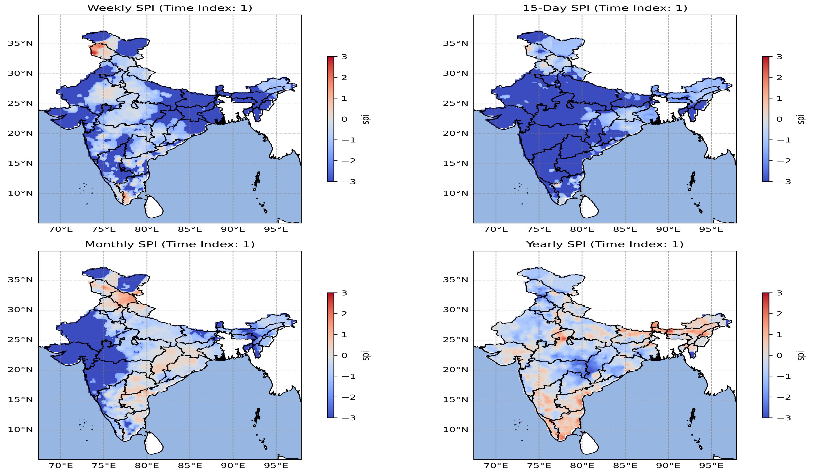

# Standardized Precipitation Index (SPI) Analysis

## Overview

Developed a Python-based workflow to calculate the Standardized Precipitation Index (SPI) from historical precipitation data for drought assessment. The project identified wet and dry conditions across multiple time scales to support climate monitoring and water resource planning.

**Study Area:** India

**Duration:** Personal Learning Project (2025)

**Role:** Solo project  

**Status:** Completed

---

## Methods & Tools

**Data Sources**

- IMD Rainfall Data

**Tools Used**

* Python
* NumPy
* SciPy
* Xarray

---

## Key Findings

- Calculated SPI at multiple temporal scales.
- Identified drought and wet periods.
- Supported drought monitoring and climate assessment.
---

## Links

[View Code](LINK){ .md-button }
[IMD Data](LINK){ .md-button }
