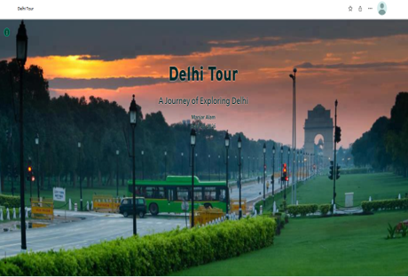

# Explore Delhi – ArcGIS StoryMap

## Overview

Created an interactive StoryMap showcasing important locations, historical landmarks, and geographic information about Delhi using ArcGIS StoryMaps. The project combines maps, multimedia, and narrative content to enhance user engagement.

**Study Area:** Delhi India

**Duration:** Personal Learning Project (2025)

**Role:** Solo project  

**Status:** Completed

---

## Methods & Tools

**Data Sources**

- ArcGIS Living Atlas
- OpenStreetMap
- Esri Basemaps

**Tools Used**

* ArcGIS StoryMaps
* ArcGIS Online

---

## Key Findings

- Integrated interactive maps with multimedia content.
- Improved visualization of cultural and historical locations.
- Demonstrated effective geospatial storytelling techniques.
---

## Links

[View StoryMap](LINK){ .md-button }
[View Dataset Catalog](LINK){ .md-button }
