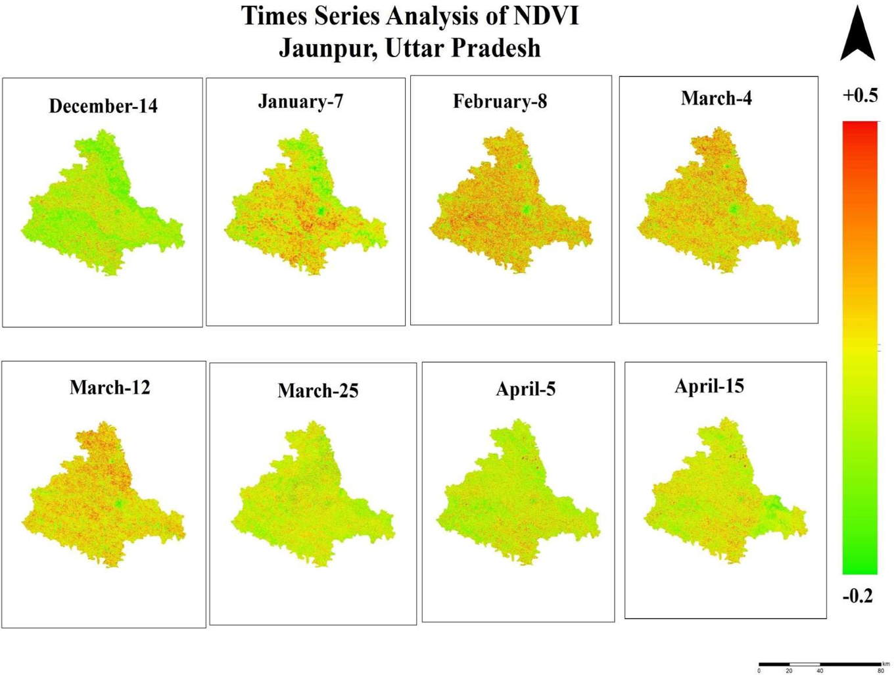

# NDVI Time Series Analysis

## Overview

Performed temporal analysis of NDVI to monitor seasonal vegetation dynamics and assess crop growth patterns in Jaunpur district. Time-series satellite imagery was used to evaluate changes in vegetation health throughout the agricultural season.

**Study Area:** Jaunpur, Uttar Pradesh

**Duration:** Personal Learning Project (2026)

**Role:** Solo project  

**Status:** Completed

---

## Methods & Tools

**Data Sources**

- Sentinel-2 Imagery (Copernicus)
- Study Area Boundary (DivaGIS)

**Tools Used**

* Google Earth Engine
* ArcGIS Pro

---

## Key Findings

- Monitored seasonal vegetation dynamics.
- Evaluated crop growth throughout the season.
- Identified healthy and stressed vegetation areas.
---

## Links

[View Project](#LINK){ .md-button }
[Copernicu Data Space](https://browser.dataspace.copernicus.eu/){ .md-button }
