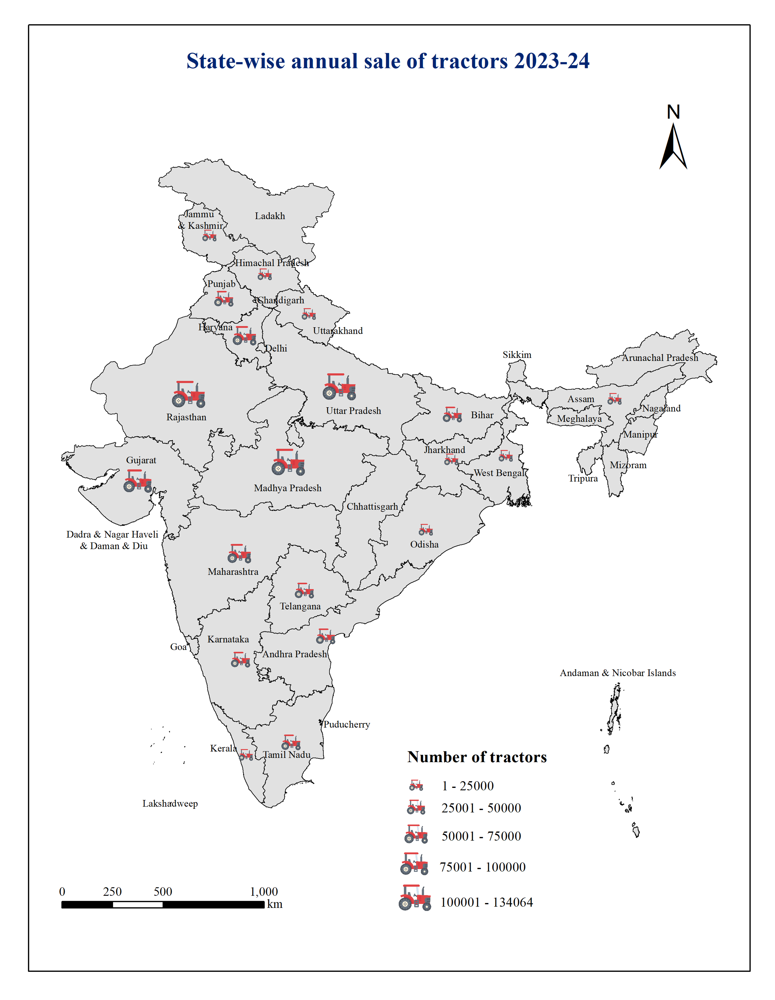

# State-wise Annual Tractor Sales Mapping

## Overview

Created a thematic map to visualize state-wise tractor sales across India using proportional symbols and spatial analysis techniques. The project highlights regional patterns of agricultural mechanization and supports comparative analysis of farming development.

**Study Area:** India

**Duration:** Personal Learning Project (2025)

**Role:** Solo project  

**Status:** Completed

---

## Methods & Tools

**Data Sources**

- Agricultural Machinery Statistics
- India State Boundary

**Tools Used**

* ArcMap
* Excel

---

## Key Findings

- Visualized state-wise tractor sales.
- Highlighted agricultural mechanization trends.
- Compared regional variations across India.
---

## Links

[View Project](#LINK){ .md-button }
[Government Open Data](#LINK){ .md-button }
